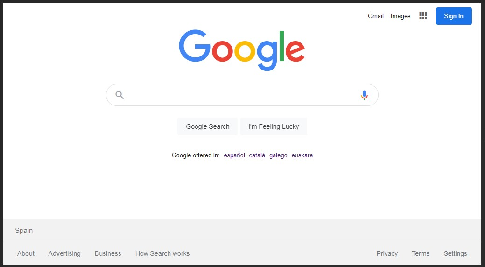
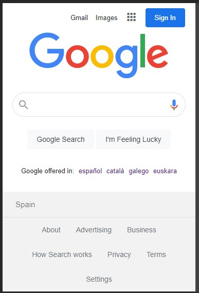

# Google Clone

> Simple Google Chrome app clone, mobile first design, coded as a JavaScript practise using Wikipedia API.

## Table of contents

- [General info](#general-info)
- [Screenshots](#screenshots)
- [Setup](#setup)
- [Code Examples](#code-examples)
- [Features](#features)
- [Inspiration](#inspiration)
- [Contact](#contact)

## General info

Following my desire to clone popular websites or features, I started with something easy that only required to use an API and some basic design.
The coding and design took me around 2-4 hours.

## Screenshots

## Setup

To run this project, downloaded and open it 😎

## Code Examples

`async function handleSearch(currentText){ 
const searchString = getSearchString(currentText); 
const rawData = await fetchData(searchString); 
return selectData(rawData); 
}`

## Features

The project is created with:

- Wikipedia API
- Plain JavaScript
- HTML with BEM notation
- SCSS

## Inspiration

The idea was taken from https://www.youtube.com/watch?v=Dk6Wopar10k&t=4026s

## Contact

Created by Cudi - feel free to contact me!
